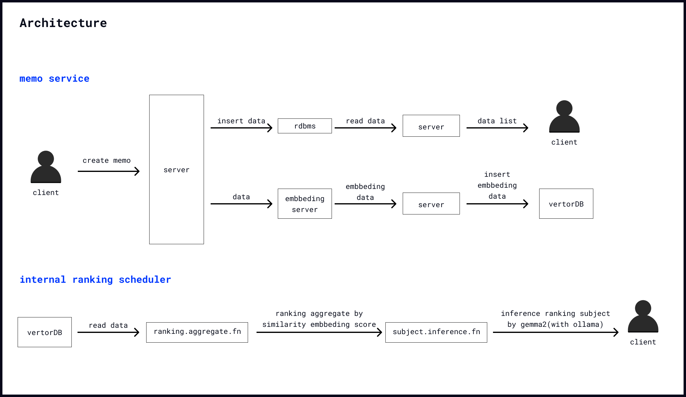

## Description

This service leverages a locally fine-tuned embedding model tailored for the Korean language to process and store user-created memo lists in a vector database. By analyzing the similarity of the vectorized data, the system ranks frequently written tasks. The ranking is further enhanced by utilizing gemma2, a local large language model (LLM), ensuring a seamless and intelligent task prioritization experience.

## Fine_Tuning_Model

 - [fine-tuned embedding model](https://github.com/fkwsur/text_embbeding_finetuning)

## Architecture

